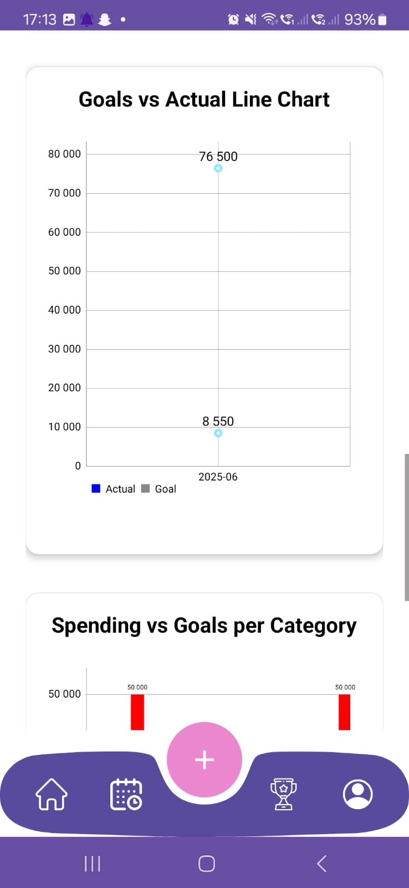
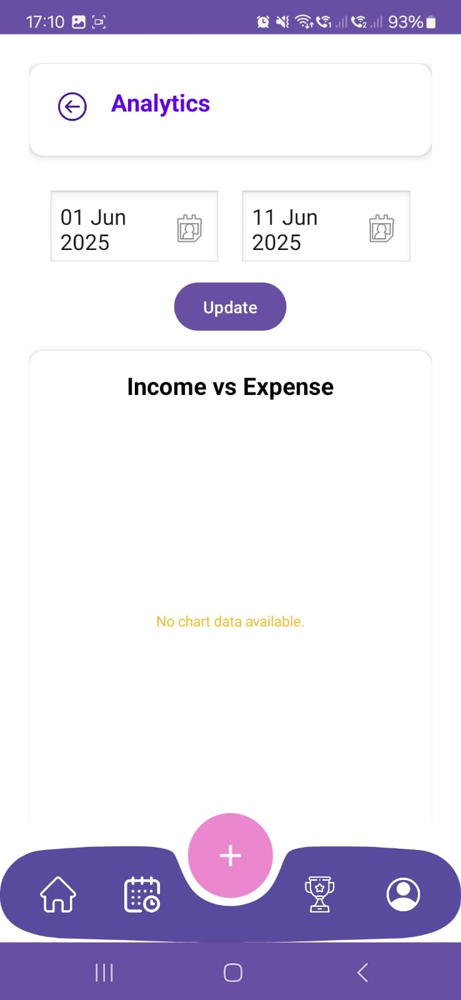
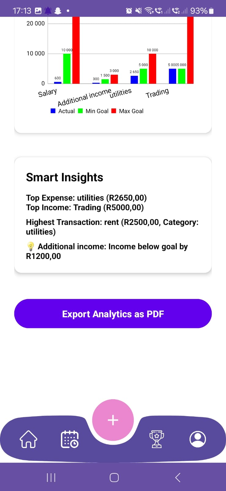

# 💰📱 Thryft Budget App

Module Name: Programming 3A \[PROG7313]
Assessment Type: PoE - Part 3 (Final)
IIE Varsity College Westville

---
## 📁Table of Contents

1. Introduction
2. Purpose
3. Design Decisions
4. GitHub Actions
5. Setting Up the Project Locally & Usage
6. Requirements and Features
7. Functionality
8. Image Assets
9. Architecture
10. Change Log
11. Authors & Contributors
12. MIT License
13. Frequently Asked Questions (FAQ)
14. Links
15. References
---
## ✨ 1. Introduction

The Thryft Budget App is an online mobile application built using Kotlin and Android Studio. It is designed to empower individuals with meaningful insights into their spending and saving habits, providing a structured yet flexible interface for managing daily finances.

This application is centered around the core principles of budgeting — planning income, tracking expenses, comparing against limits, and ultimately helping users stay financially healthy. In its current prototype, the app stores data locally using RoomDB, offering full functionality without requiring internet access.

Firebase integration for cloud sync and authentication is prepared and will be introduced in future updates.
---
## 🌟 2. Purpose

The purpose of the Thryft Budget App is to create a user-friendly, engaging mobile application that helps users manage their personal finances effectively. The app aims to simplify the often tedious and stressful task of budgeting by allowing users to track their spending habits, set savings goals, and monitor their financial progress in an intuitive and enjoyable way. A key focus is incorporating gamification elements to make the budgeting process fun and rewarding, encouraging consistent use. The app is designed to assist users in categorizing expenses, setting budgets, visualizing spending trends, and storing data both locally and online for accessibility across devices.

### - Core objectives:

\-- Enable users to register and log in securely with a email and password, using Firebase Auth.
\-- Allow users to create and categorize expenses (e.g., "Groceries," "Entertainment," "Transport").
\-- Support entry with details such as amount, description, transaction type (e.g. toggle between income or expense), category, and optionally add a photo from gallery or camera.
\-- Facilitate the setting of monthly budget goals and category-specific limits.
\-- Provide a visual dashboard to track progress against budget goals, highlighting overspending.
\-- Display spending trends through graphs for user-selectable periods.
\-- Incorporate gamification features like rewards or badges for meeting budget goals or consistent logging.
\-- Store data in an online database Firebase (Firestore DB) for the final submission to enable cross-device access.
---
## 🎨 3. Design Decisions

The design decisions for the app are informed by the research, planning, and implementation requirements. These decisions aim to ensure functionality, usability, and engagement while adhering to the technical and academic requirements of the course.

### Key design decisions:

* User Interface (UI) Design
  \-- Intuitive and Engaging Layout: The UI is designed to be appealing and easy to navigate, addressing the perception that budgeting is tedious.
  \-- Error Handling: The app is built to handle invalid user inputs gracefully without crashing.
  \-- Gamification Elements: Includes badges or rewards for meeting budget goals.
  \-- Visual Feedback: Graphs and dashboards to quickly convey budget progress.

* Functionality and Features
  \-- Graphical Representation: A graph shows daily spending by category over a selectable period.
  \-- Progress Dashboard: Displays how well users are staying within budget.
  \-- Online Database: Uses Firebase for cross-device data syncing.
  \-- Custom Features: Includes export and dark/light mode.

* User Experience Considerations
  \-- Engaging and stress-free design
  \-- Clean UI with error handling
  \-- Ability to attach receipt images
---
## 🤖 4. GitHub Actions

yaml
name: Android Build

on:
  push:
    branches: [ main ]
  pull_request:
    branches: [ main ]

jobs:
  build:
    runs-on: ubuntu-latest

    steps:
    - name: Checkout Repository
      uses: actions/checkout@v3

    - name: Set up JDK 17
      uses: actions/setup-java@v3
      with:
        distribution: 'temurin'
        java-version: '17'

    - name: Give gradlew permission
      run: chmod +x ./gradlew

    - name: Build Debug APK
      run: ./gradlew assembleDebug

---
## 💻 5. Setting Up the Project Locally & Usage

### Prerequisites:

* Android Studio IDE
* JDK 17+
* Kotlin 1.8+
* Gradle 8.0+
* Android device/emulator with API 24+
* Internet (only for Firebase setup)

### Installation Steps:

1. Clone or download the repository
2. Open in Android Studio
3. Allow Gradle to sync dependencies
4. Run the application on an emulator or device
5. Place google-services.json in the app folder (if needed)

### How to Use

* Add income/expenses
* Create categories and budgets
* View analytics
* Export PDFs
* Toggle dark/light mode
---
## ✅ 6. Requirements and Features

### Non-Functional Requirements:

* Security: Firebase Auth + Firestore
* Performance: Smooth and fast
* Scalability: Firebase-ready
* Compatibility: Android 7.0+
* Maintainability: Modular code
* Usability: Visual, user-friendly interface

### Required Functionalities:

* Line graph: Goal vs Actual
* Triple bar graph: Income, Expense, Actual

### Additional Features:

* Export analytics & transactions
* Dark/light mode toggle

### Extra Features:

* Pie chart: Income vs Expense
* Smart Insights: Top spending, income
---
## ⚙ 7. Functionality

* Add/delete transactions
* Assign icons to categories
* Attach receipt images
* Summarized views by date/category
* Graphs and visual data
* PDF export
* Search/filter features
* Dark/light mode toggle
* Firebase Firestore + Auth
---
## 🖼 8. Image Assets

---
## 🏠 9. Architecture

* MVVM Architecture
* Model: Room DB Entities and DAOs
* View: Activities and Fragments
* ViewModel: Business Logic and LiveData
---
## 🗒 10. Change Log

* Added: Spending Trend Graph, Progress Dashboard
* Added: Export and Dark Mode Features
* Upgraded: RoomDB replaced by Firebase Firestore
---
## 👥 11. Authors & Contributors

* Braden Caleb Perumal (ST10287165)
* Nikhile Reddy (ST10338305)

Contact: [dbw@varsitycollege.co.za](mailto:dbw@varsitycollege.co.za) or [StudentServicesWVL@varsitycollege.co.za](mailto:StudentServicesWVL@varsitycollege.co.za)
---
## ⚖ 12. MIT License

Permission is hereby granted, free of charge, to any person obtaining a copy of this software and associated documentation files (the "Software"), to deal in the Software without restriction...

\##❓ 13. Frequently Asked Questions (FAQ)

* *Can I register or log in?* Not yet. Firebase Auth is coming.
* *How do I know if I’ve overspent?* Progress bars will turn red.
* *Can I search transactions?* Yes – by keyword, date, or type.
* *Where are images stored?* Locally, linked via URI.
---

## 14. Links

(Repository will be added when published)
---
## GitHub Repository: https://github.com/nikhilereddy/ThryftBudgetingApp.git
---
## Thryft Budget App APK Repository: [https://github.com/CalebPerumal28/ThryftAppBuildApkPOE.git](https://github.com/CalebPerumal28/ThryftAppBuildApkPOE.git)
---
## Video Demonstration with voice over showing app mirrored from physical device to android studio in order to easily demonstrate data entries in Firebase Auth and Firestore DB
## (OneDrive Shared Link):[https://dlssa-my.sharepoint.com/:v:/g/personal/caleb_dlssa_onmicrosoft_com/EXX1idjCkUtPqGdmi7aXupcB9TDfNiteit3gIg7AYvR2jg](https://dlssa-my.sharepoint.com/:v:/g/personal/caleb_dlssa_onmicrosoft_com/EXX1idjCkUtPqGdmi7aXupcB9TDfNiteit3gIg7AYvR2jg)
---
## Video Demonstration of screenrecordign via the physical device (no voice over)
## (OneDrive Shared Link):[https://dlssa-my.sharepoint.com/:v:/g/personal/caleb_dlssa_onmicrosoft_com/EeZlozB55o1Hg-5sKRg2_LoBrLTA7PYUBO4bRkJOOy8sVQ](https://dlssa-my.sharepoint.com/:v:/g/personal/caleb_dlssa_onmicrosoft_com/EeZlozB55o1Hg-5sKRg2_LoBrLTA7PYUBO4bRkJOOy8sVQ)
---
## 📚 15. References

* BroCode, n.d. Android Development for Beginners. [online] YouTube. Available at: https://www.youtube.com/@BroCodez [Accessed 2 May 2025].

* PhilJay, n.d. MPAndroidChart. [online] GitHub. Available at: https://github.com/PhilJay/MPAndroidChart [Accessed 2 May 2025].

* JetBrains, n.d. Kotlin Language Documentation. [online] KotlinLang.org. Available at: https://kotlinlang.org/docs/home.html [Accessed 2 May 2025].

* Android Developers, n.d. Room Persistence Library. [online] Available at: https://developer.android.com/jetpack/androidx/releases/room [Accessed 2 May 2025].

* Android Developers, n.d. PdfDocument API. [online] Available at: https://developer.android.com/reference/android/graphics/pdf/PdfDocument [Accessed 2 May 2025].

* Android Developers, n.d. ViewModel Overview. [online] Available at: https://developer.android.com/topic/libraries/architecture/viewmodel [Accessed 2 May 2025].

* Stack Overflow, n.d. Stack Overflow: Developer Community. [online] Available at: https://stackoverflow.com/ [Accessed 2 May 2025].

* Kusnier, J. (2022) Liquid Bottom Navigation UI Design in Jetpack Compose. [YouTube video] Available at: https://youtu.be/nP42CBV5Rd0 (Accessed: 2 May 2025).
